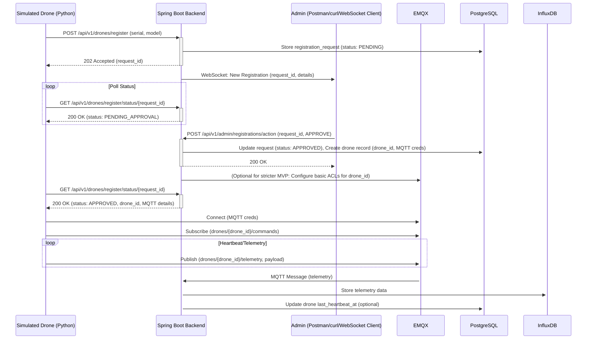

# UAV Management System: MVP Development Guide

## 1. Introduction & MVP Goals

**Purpose:** This guide provides a focused path for developers to implement and validate the Minimum Viable Product (MVP) of the UAV Management System. The primary goal is rapid local development and verification of core features.

**MVP Core Features:**

*   **UAV Registration Request:** UAV (simulated) sends registration details (serial number, model) via HTTP REST API.
*   **Administrator Approval/Rejection:** Admin (simulated via API calls) approves or rejects registration requests.
*   **UAV Polls for Status:** UAV polls for its registration status via HTTP REST API.
*   **Credential Delivery:** Upon approval, the system provides the UAV with its unique ID, MQTT broker details, topics, and credentials.
*   **MQTT Communication:**
    *   UAV connects to EMQX using provided credentials.
    *   UAV periodically publishes heartbeat/telemetry data (location, status, battery) to a specific MQTT topic.
*   **Data Persistence:**
    *   Backend (Spring Boot) stores registration information and UAV details in PostgreSQL.
    *   Backend stores received UAV telemetry data in InfluxDB.
*   **Admin Notification (Basic):** Backend pushes a notification (e.g., via WebSocket) when a new registration request is submitted.

**Out of MVP Scope (for now):**

*   Full-fledged Admin User Interface (UI interactions will be simulated via API calls or a very basic client).
*   Advanced security features (e.g., OAuth2, complex MQTT ACLs beyond basic user/topic restrictions, API rate limiting).
*   Detailed UI for drone control or data visualization.
*   Mission planning, geofencing, video streaming.
*   Robust, production-grade error handling, retries, and circuit breakers (focus is on logging errors and core path functionality).
*   Production deployment considerations.

## 2. System Architecture (MVP Overview)



## 3. Setting Up Your Local Development Environment

Refer to the main `README.md` for prerequisites (Docker, JDK 17, Maven, Node.js).

1.  **Clone the Repository:** Ensure you have the project structure containing `backend/`, `vue-vben-admin/`, `docker-compose.yml`, etc.
2.  **Start Infrastructure Services:**
    ```bash
    docker-compose up -d postgres influxdb emqx
    ```
    This uses the configurations defined in your `docker-compose.yml`.
3.  **Verify Services:**
    *   **PostgreSQL:** Port `5432`. Connect using `psql` or a GUI tool (e.g., pgAdmin).
        *   DB: `dronedb`, User: `drone`, Pass: `dronepassword`
    *   **InfluxDB:** UI at `http://localhost:8086`.
        *   User: `admin`, Pass: `influxdb123`, Org: `drone_org`, Bucket: `drone_data`, Token: `my-super-secret-token`
    *   **EMQX:** Dashboard at `http://localhost:18083`.
        *   User: `admin`, Pass: `public`. MQTT port: `1883`.
4.  **Backend Setup:** Navigate to the `backend` directory. Dependencies are managed by `pom.xml`.
5.  **Frontend Setup:** (For future UI integration, not critical for backend MVP) Navigate to `vue-vben-admin/apps/web-antd`, run `npm install`.

## 4. Backend Development (Spring Boot - in `backend/`)

### 4.1. Configuration (`src/main/resources/application.properties` or `application.yml`)

Ensure your Spring Boot application is configured to connect to the Dockerized services. The `docker-compose.yml` already sets environment variables for the `backend` service, which Spring Boot can pick up. Example properties if not using environment variables directly:

```properties
# PostgreSQL
spring.datasource.url=jdbc:postgresql://localhost:5432/dronedb
spring.datasource.username=drone
spring.datasource.password=dronepassword
spring.jpa.hibernate.ddl-auto=update # For dev, 'update' is okay; 'validate' or 'none' for prod
spring.jpa.properties.hibernate.dialect=org.hibernate.dialect.PostgreSQLDialect

# InfluxDB
influxdb.url=http://localhost:8086
influxdb.token=my-super-secret-token
influxdb.org=drone_org
influxdb.bucket=drone_data

# MQTT (EMQX)
mqtt.broker.url=tcp://localhost:1883
mqtt.client.id=drone-backend-service # Or generate dynamically
# mqtt.username= (if EMQX requires auth for backend connection)
# mqtt.password=
```

### 4.2. Core Packages (Suggested Structure)

*   `com.huang.backend.config`: Spring configuration (Beans, Security, WebSocket, MQTT).
*   `com.huang.backend.common.dto`: Data Transfer Objects.
*   `com.huang.backend.common.exception`: Custom exceptions and global error handler.
*   `com.huang.backend.registration.controller`: REST controllers for registration.
*   `com.huang.backend.registration.service`: Business logic for registration.
*   `com.huang.backend.registration.entity`: JPA entities for registration (e.g., `DroneRegistrationRequest`).
*   `com.huang.backend.registration.repository`: Spring Data JPA repositories.
*   `com.huang.backend.drone.entity`: JPA entity for `Drone`.
*   `com.huang.backend.drone.repository`: JPA repository for `Drone`.
*   `com.huang.backend.drone.service`: Service for drone-specific logic after approval.
*   `com.huang.backend.mqtt`: MQTT client setup, message listener components, message processing logic.
*   `com.huang.backend.timeseries`: Service for interacting with InfluxDB.
*   `com.huang.backend.websocket`: WebSocket configuration and message handlers for admin notifications.

### 4.3. Database Schemas (MVP Focus)

**PostgreSQL (JPA Entities):**

*   **`DroneRegistrationRequest` Entity:**
    *   `request_id` (UUID, PK)
    *   `serial_number` (String, NotNull)
    *   `model` (String, NotNull)
    *   `status` (String - e.g., "PENDING_APPROVAL", "APPROVED", "REJECTED", NotNull)
    *   `requested_at` (Timestamp, NotNull)
    *   `processed_at` (Timestamp)
    *   `rejection_reason` (String, Nullable)
    *   `drone_id` (UUID, Nullable, Unique - Foreign key to `Drone` table if approved)
*   **`Drone` Entity:**
    *   `drone_id` (UUID, PK)
    *   `serial_number` (String, Unique, NotNull)
    *   `model` (String, NotNull)
    *   `registration_request_id` (UUID, Unique, NotNull - Link to `DroneRegistrationRequest`)
    *   `approved_at` (Timestamp, NotNull)
    *   `mqtt_username` (String, Unique, NotNull)
    *   `mqtt_password_hash` (String, NotNull) - Use BCrypt
    *   `mqtt_topic_telemetry` (String, NotNull) - e.g., `drones/{drone_id}/telemetry`
    *   `mqtt_topic_commands` (String, NotNull) - e.g., `drones/{drone_id}/commands`
    *   `last_heartbeat_at` (Timestamp, Nullable)
    *   `current_status` (String, Nullable - e.g., "ONLINE", "OFFLINE")

**InfluxDB (Service Logic):**

*   Measurement: `drone_telemetry`
*   Tags: `drone_id` (String)
*   Fields:
    *   `latitude` (Double)
    *   `longitude` (Double)
    *   `altitude` (Double)
    *   `battery_percentage` (Integer)
    *   `flight_status` (String - e.g., "IDLE", "FLYING", "HEARTBEAT")
*   Timestamp: Handled by InfluxDB client or use UAV-provided timestamp.

### 4.4. API Endpoints (Core for MVP)

(Refer to API definitions in the previous detailed response. Implement these using Spring MVC `@RestController`, `@PostMapping`, `@GetMapping` etc.)

*   `POST /api/v1/drones/register`
*   `GET /api/v1/drones/register/status/{request_id}`
*   `POST /api/v1/admin/registrations/action`

**API Error Response Format (MVP):**

```json
{
  "timestamp": "2023-10-28T12:34:56.789Z",
  "status": 400,
  "error": "Bad Request",
  "message": "Validation failed: serial_number cannot be blank.",
  "path": "/api/v1/drones/register"
}
```
Implement using a global `@ControllerAdvice` and `@ExceptionHandler`.

### 4.5. MQTT Integration

*   **Client:** Use `org.eclipse.paho.client.mqttv3` (version `1.2.5` from `pom.xml`).
*   **Configuration:** Create Spring beans for `MqttClient`, connection options.
*   **Subscriber:** A Spring `@Component` that subscribes to `drones/+/telemetry` (or similar wildcard for all drone telemetry).
    *   On message: Parse JSON payload.
    *   Persist to InfluxDB using `influxdb-client-java`.
    *   Optionally, update `drones.last_heartbeat_at` in PostgreSQL.
*   **Telemetry Payload (JSON - Drone to System):**
    ```json
    {
      "timestamp": "2023-10-28T12:34:56Z", // ISO8601
      "latitude": 34.0522,
      "longitude": -118.2437,
      "altitude": 150.5,
      "battery_percentage": 75,
      "flight_status": "FLYING"
    }
    ```

### 4.6. Password Hashing (MQTT Passwords)

*   Use Spring Security's `BCryptPasswordEncoder`.
    ```java
    // In a @Configuration class
    @Bean
    public PasswordEncoder passwordEncoder() {
        return new BCryptPasswordEncoder();
    }
    ```
*   When an admin approves registration and a drone record is created:
    1.  Generate a secure random plain-text password for the drone's MQTT connection.
    2.  Hash it: `String hashedPassword = passwordEncoder.encode(plainPassword);`
    3.  Store `hashedPassword` in `drones.mqtt_password_hash`.
    4.  Return the `plainPassword` (along with username, topics, broker URL) in the API response for `/api/v1/drones/register/status/{request_id}` when status is `APPROVED`. **This is the only time the plain password is sent.**

### 4.7. Data Validation (MVP - Basic)

*   For API input DTOs (e.g., `DroneRegistrationRequestDto`), use JSR 303/380 bean validation annotations:
    *   `@NotBlank`, `@NotEmpty`, `@NotNull` for essential fields like `serial_number`, `model`.
*   No complex regex or range validation for MVP. Focus on presence.

### 4.8. Logging (MVP - SLF4J with Logback)

*   **Levels:** `INFO` for major workflow steps (e.g., "Registration request received", "Drone approved", "Telemetry for drone X processed"). `DEBUG` for detailed request/payload data during development. `ERROR` for exceptions and failures.
*   **Content:** Timestamps, level, thread, logger name, and a clear message. Include relevant IDs (`request_id`, `drone_id`, `serial_number`) in log messages for easier tracing.

### 4.9. WebSocket for Admin UI Notifications

*   **Dependency:** Add `spring-boot-starter-websocket`.
*   **Configuration:** Create a `@Configuration` class extending `WebSocketMessageBrokerConfigurer` to set up a simple message broker and endpoint (e.g., `/ws/admin`).
*   **Handler/Service:** When a new registration request is created in `DroneRegistrationService`, or when an admin processes a request, use `SimpMessagingTemplate` to send a message to a topic like `/topic/registrations`.
    *   **New Request Message:**
        ```json
        { "type": "NEW_REGISTRATION", "data": { "request_id": "...", "serial_number": "...", "model": "...", "requested_at": "..." } }
        ```
    *   **Status Update Message:**
        ```json
        { "type": "REGISTRATION_UPDATE", "data": { "request_id": "...", "status": "APPROVED/REJECTED", "drone_id": "..." } }
        ```

## 5. (Simulated) Drone Client (Python - `sim_drone.py`)

Create a Python script to simulate drone behavior.

*   **Libraries:**
    ```bash
    pip install requests paho-mqtt~=1.6.1
    ```
*   **Workflow Outline:**
    ```python
    import requests
    import paho.mqtt.client as mqtt
    import time
    import json
    import uuid

    BACKEND_URL = "http://localhost:8080/api/v1" # Adjust if Spring context path is used
    DRONE_SERIAL = f"SIM-{str(uuid.uuid4())[:8]}"
    DRONE_MODEL = "SimDroneV1"

    request_id = None
    drone_info = None

    def register_drone():
        global request_id
        payload = {"serial_number": DRONE_SERIAL, "model": DRONE_MODEL}
        response = requests.post(f"{BACKEND_URL}/drones/register", json=payload)
        if response.status_code == 202:
            data = response.json()
            request_id = data.get("request_id")
            print(f"Drone registration requested. Serial: {DRONE_SERIAL}, Request ID: {request_id}")
        else:
            print(f"Registration failed: {response.status_code} - {response.text}")
            exit()

    def poll_status():
        global drone_info
        if not request_id: return
        print(f"Polling status for request ID: {request_id}...")
        response = requests.get(f"{BACKEND_URL}/drones/register/status/{request_id}")
        if response.status_code == 200:
            data = response.json()
            status = data.get("status")
            print(f"Status: {status}")
            if status == "APPROVED":
                drone_info = data
                print(f"Drone Approved! Info: {drone_info}")
                return True
            elif status == "REJECTED":
                print(f"Drone Rejected. Reason: {data.get('reason')}")
                exit()
        else:
            print(f"Polling failed: {response.status_code} - {response.text}")
        return False

    # MQTT Callbacks
    def on_connect(client, userdata, flags, rc, properties=None): # Add properties for paho-mqtt >=2.0.0
        if rc == 0:
            print("Connected to MQTT Broker!")
            # Subscribe to command topic (optional for MVP telemetry sending)
            # client.subscribe(drone_info["mqtt_topic_commands"])
            # print(f"Subscribed to {drone_info['mqtt_topic_commands']}")
        else:
            print(f"Failed to connect, return code {rc}\n")

    def on_publish(client, userdata, mid, properties=None): # Add properties for paho-mqtt >=2.0.0
        print(f"Telemetry data published with MID: {mid}")

    def run_mqtt_client():
        if not drone_info: return

        client = mqtt.Client(mqtt.CallbackAPIVersion.VERSION2, client_id=f"drone-{drone_info['drone_id'][:8]}")
        client.username_pw_set(drone_info["mqtt_username"], drone_info["mqtt_password"])
        client.on_connect = on_connect
        client.on_publish = on_publish
        
        broker_url = drone_info["mqtt_broker_url"].replace("tcp://", "")
        broker_address, broker_port = broker_url.split(":")
        
        try:
            client.connect(broker_address, int(broker_port), 60)
        except Exception as e:
            print(f"MQTT connection error: {e}")
            return

        client.loop_start()
        
        telemetry_topic = drone_info["mqtt_topic_telemetry"]
        count = 0
        while True:
            count += 1
            payload = {
                "timestamp": time.strftime("%Y-%m-%dT%H:%M:%SZ", time.gmtime()),
                "latitude": 34.0522 + (count * 0.0001),
                "longitude": -118.2437 + (count * 0.0001),
                "altitude": 150.0 + count,
                "battery_percentage": 100 - (count % 100),
                "flight_status": "HEARTBEAT" if count % 2 == 0 else "FLYING"
            }
            result = client.publish(telemetry_topic, json.dumps(payload), qos=1) # QoS 1 for some reliability
            # result.wait_for_publish() # Uncomment if synchronous publish is needed
            print(f"Attempting to publish to {telemetry_topic}: {json.dumps(payload)}")
            time.sleep(10) # Send telemetry every 10 seconds

    if __name__ == "__main__":
        register_drone()
        approved = False
        while not approved:
            time.sleep(5) # Poll every 5 seconds
            approved = poll_status()
        
        if approved:
            run_mqtt_client()
    ```

## 6. Admin UI Interaction (MVP - Use `curl` or Postman)

The Admin UI (`vue-vben-admin`) connects to the backend via `/spring` proxy. For direct backend testing for MVP:

*   **Receive WebSocket Notifications:** Use a simple WebSocket client (e.g., browser extension, online tool) to connect to `ws://localhost:8080/ws/admin/websocket` (adjust path if Spring context path or different WebSocket endpoint is used) and subscribe to `/topic/registrations`.
*   **Approve/Reject Registration:**
    Use `curl` (or Postman) to call the admin action endpoint. Replace `YOUR_REQUEST_ID_FROM_LOGS_OR_WS`.
    ```bash
    # To APPROVE
    curl -X POST -H "Content-Type: application/json" \
    -d '{"request_id": "YOUR_REQUEST_ID_FROM_LOGS_OR_WS", "action": "APPROVE"}' \
    http://localhost:8080/api/v1/admin/registrations/action

    # To REJECT
    curl -X POST -H "Content-Type: application/json" \
    -d '{"request_id": "YOUR_REQUEST_ID_FROM_LOGS_OR_WS", "action": "REJECT", "rejection_reason": "Test rejection"}' \
    http://localhost:8080/api/v1/admin/registrations/action
    ```

## 7. MVP Validation Workflow

1.  **Start Services:** `docker-compose up -d postgres influxdb emqx` (from project root).
2.  **Start Backend:** Run your Spring Boot application from your IDE or using `./mvnw spring-boot:run` in the `backend` directory.
3.  **Run Drone Simulator:** Execute `python sim_drone.py`.
    *   Observe backend logs: New registration request, `request_id` logged.
    *   Observe WebSocket client: Notification of new registration.
    *   Observe drone script: Polling status.
4.  **Approve Registration:** Use `curl` (as above) to send an "APPROVE" action using the `request_id`.
    *   Observe backend logs: Approval processed, drone record created, MQTT details generated.
    *   Observe WebSocket client: Registration update notification.
    *   Observe drone script: Receives "APPROVED" status and MQTT details.
5.  **Verify MQTT Communication:**
    *   Observe drone script: Connects to EMQX and starts publishing telemetry.
    *   Observe backend logs: MQTT messages received, processed, data sent to InfluxDB.
    *   Check EMQX Dashboard (`http://localhost:18083`): See client connected, messages flowing.
6.  **Verify Data Persistence:**
    *   **PostgreSQL:** Connect to `dronedb` and query `drone_registration_requests` and `drones` tables.
    *   **InfluxDB:** Use InfluxDB UI (`http://localhost:8086`) to query the `drone_data` bucket (measurement `drone_telemetry`) for the simulated drone's data.

## 8. Next Steps (Post-MVP Enhancements)

*   Develop the actual Admin UI in `vue-vben-admin`.
*   Implement robust security (API authentication for admin, detailed MQTT ACLs).
*   Add more comprehensive data validation and error handling.
*   Implement drone command functionalities via MQTT.
*   Expand telemetry data and analytics.
*   Consider production deployment strategies.

This guide should provide a clear path for the MVP. Adjust API paths and ports if your local Spring Boot setup differs (e.g. if it runs with a context path like `/spring` even in direct development).


总体原则：

- 迭代开发，小步快跑 ：将大功能拆解成小模块，每个模块开发完成后立即测试。
- 测试驱动（TDD）理念 ：尽可能先编写测试用例（尤其是单元测试和集成测试），再进行功能开发。
- 持续集成（CI）思维 ：虽然 MVP 阶段可能不搭建完整 CI/CD，但本地开发也应频繁集成和测试。
- 文档同步 ：开发过程中，同步更新必要的 API 文档和模块说明。
开发与测试计划：

阶段一：环境搭建与基础配置

1. 任务 ：
   - 确保 docker-compose up -d postgres influxdb emqx 能够成功启动所有基础服务。
   - 验证各服务端口和访问凭证是否与 `MVPDevelopmentGuide.md` 中描述一致。
   - 搭建 Spring Boot 后端项目骨架，引入必要依赖（Spring Web, Spring Data JPA, PostgreSQL Driver, InfluxDB Client, Paho MQTT Client, Spring WebSocket）。
   - 配置 application.properties 或 application.yml 连接到 PostgreSQL, InfluxDB, EMQX。
2. 测试 ：
   - 手动验证 ：
     - 使用 psql 或 pgAdmin 连接 PostgreSQL。
     - 访问 InfluxDB UI ( http://localhost:8086 ) 并使用凭证登录。
     - 访问 EMQX Dashboard ( http://localhost:18083 ) 并使用凭证登录。
   - 后端启动测试 ：启动 Spring Boot 应用，检查日志中是否有数据库连接成功、MQTT 客户端尝试连接等信息。
阶段二：无人机注册流程 (核心API与PostgreSQL集成)

1. 任务 2.1：JPA 实体与 Repositories
   
   - 开发 ：
     - 创建 DroneRegistrationRequest JPA 实体，包含 `MVPDevelopmentGuide.md` 中定义的字段。
     - 创建 Drone JPA 实体，包含定义的字段。
     - 创建对应的 Spring Data JPA Repositories ( DroneRegistrationRequestRepository , DroneRepository )。
   - 测试 ：
     - 单元测试 ：为 Repositories 编写单元测试（可使用 H2 内存数据库或 Testcontainers），测试基本的 CRUD 操作。
2. 任务 2.2：无人机注册请求 API ( POST /api/v1/drones/register )
   
   - 开发 ：
     - 创建 DroneRegistrationRequestDto 用于接收请求数据。
     - 实现 JSR 303/380 Bean Validation 对 DTO 进行校验。
     - 创建 RegistrationController 和 RegistrationService 。
     - Service 逻辑：保存注册请求到 PostgreSQL，状态设为 PENDING_APPROVAL ，生成 request_id 。
     - Controller 返回 202 Accepted 和 request_id 。
   - 测试 ：
     - 集成测试/手动测试 ：
       - 使用 Postman 或 curl 发送合法的注册请求，验证响应状态码和内容。
       - 检查 PostgreSQL drone_registration_requests 表中是否正确插入了数据。
       - 发送包含无效数据（如缺少 serial_number ）的请求，验证是否返回 400 Bad Request 及错误信息。
3. 任务 2.3：查询注册状态 API ( GET /api/v1/drones/register/status/{request_id} )
   
   - 开发 ：
     - 在 RegistrationController 和 RegistrationService 中实现。
     - Service 逻辑：根据 request_id 从 PostgreSQL 查询注册请求状态和相关信息。
   - 测试 ：
     - 集成测试/手动测试 ：
       - 使用上一步获得的 request_id ，通过 Postman 或 curl 查询状态，验证返回的状态是否为 PENDING_APPROVAL 。
       - 测试查询不存在的 request_id ，验证是否返回 404 Not Found。
4. 任务 2.4：管理员审批 API ( POST /api/v1/admin/registrations/action )
   
   - 开发 ：
     - 创建 AdminActionDto (包含 request_id , action , rejection_reason )。
     - 在 RegistrationController 和 RegistrationService 中实现。
     - Service 逻辑：
       - Approve : 更新 DroneRegistrationRequest 状态为 APPROVED ，创建新的 Drone 记录（生成 drone_id , mqtt_username , 明文 mqtt_password ，使用 BCrypt 哈希密码后存入 mqtt_password_hash ，生成 MQTT topics），关联 drone_id 到 DroneRegistrationRequest 。
       - Reject : 更新 DroneRegistrationRequest 状态为 REJECTED ，记录 rejection_reason 。
     - 配置 BCryptPasswordEncoder Bean。
   - 测试 ：
     - 集成测试/手动测试 ：
       - 使用 Postman 或 curl 对一个 PENDING_APPROVAL 的请求发送 APPROVE 操作。
         - 验证 drone_registration_requests 表状态更新。
         - 验证 drones 表中是否创建了新记录， mqtt_password_hash 是否已哈希。
         - 记录下生成的明文 mqtt_password (用于后续测试)。
       - 对另一个请求发送 REJECT 操作，验证状态和 rejection_reason 。
5. 任务 2.5：凭证交付 (通过查询状态 API)
   
   - 开发 ：
     - 修改 GET /api/v1/drones/register/status/{request_id} 的 Service 逻辑：如果状态为 APPROVED ，则响应中包含 drone_id , mqtt_broker_url , mqtt_username , 明文 mqtt_password , mqtt_topic_telemetry , mqtt_topic_commands 。
   - 测试 ：
     - 集成测试/手动测试 ：
       - 对一个已批准的请求，调用此 API，验证响应中是否包含所有 MQTT 相关凭证和信息，特别是之前记录的明文密码。
6. 任务 2.6：WebSocket 管理员通知
   
   - 开发 ：
     - 添加 spring-boot-starter-websocket 依赖。
     - 配置 WebSocket (端点如 /ws/admin ，订阅前缀如 /topic )。
     - 在 RegistrationService 中注入 SimpMessagingTemplate 。
     - 当新的注册请求创建时，发送类型为 NEW_REGISTRATION 的消息到 /topic/registrations 。
     - 当注册请求被处理 (Approve/Reject) 时，发送类型为 REGISTRATION_UPDATE 的消息。
   - 测试 ：
     - 手动测试 ：使用简单的 WebSocket 客户端 (如浏览器插件或在线工具) 连接到 ws://localhost:8080/ws/admin/websocket 并订阅 /topic/registrations 。
       - 通过 API 提交新的注册请求，验证客户端是否收到 NEW_REGISTRATION 通知。
       - 通过 API 审批/拒绝请求，验证客户端是否收到 REGISTRATION_UPDATE 通知。
阶段三：MQTT 通信链路整合

1. 任务 3.1：后端 MQTT 订阅者与 InfluxDB 集成初步
   
   - 开发 ：
     - 配置 Paho MQTT 客户端 Bean ( MqttClient )，设置连接选项 (EMQX URL)。
     - 创建 MqttSubscriberService ( @Component )，在应用启动后连接到 EMQX 并订阅遥测主题 (e.g., drones/+/telemetry 或更具体的 drones/# 然后在代码中过滤)。
     - 实现 messageArrived 回调：
       - 解析收到的 JSON 遥测数据。
       - 配置 InfluxDB 客户端 ( InfluxDBClient ) Bean。
       - 创建 TimeseriesService 用于将数据写入 InfluxDB。
       - 在回调中调用 TimeseriesService 将解析后的数据点（包含 drone_id tag 和 các trường遥测字段）写入 InfluxDB 的 drone_data bucket 和 drone_telemetry measurement。
       - (可选) 更新 PostgreSQL 中对应 Drone 的 last_heartbeat_at 。
   - 测试 ：
     - 集成测试/手动测试 ：
       - 启动后端。
       - 使用 MQTT 客户端工具 (如 MQTTX, mosquitto_pub) 手动向 EMQX 的 drones/some_drone_id/telemetry 主题发布符合格式的 JSON 遥测数据。
       - 观察后端日志，确认消息是否被接收和正确解析。
       - 检查 InfluxDB UI，确认数据是否已写入 drone_telemetry measurement，tags 和 fields 是否正确。
       - (可选) 检查 PostgreSQL drones 表的 last_heartbeat_at 是否更新。
2. 任务 3.2：模拟无人机 ( sim_drone.py ) 开发与集成
   
   - 开发 ：
     - 完善 `MVPDevelopmentGuide.md` 中提供的 sim_drone.py 脚本。
     - 确保脚本能正确执行注册、轮询状态、获取 MQTT 凭证。
     - 实现 run_mqtt_client 函数，使用从 API 获取的凭证连接到 EMQX，并定期向其 mqtt_topic_telemetry 发布遥测数据。
   - 测试 ：
     - 端到端初步测试 ：
       - 运行 sim_drone.py 。
       - 观察脚本日志，确认注册、轮询成功。
       - 手动通过 API 审批该无人机。
       - 观察脚本日志，确认获取到 MQTT 凭证并成功连接 EMQX，开始发布遥测。
       - 观察后端日志，确认接收到来自模拟无人机的遥测数据。
       - 检查 InfluxDB 和 PostgreSQL 中的数据。
阶段四：端到端验证与完善

1. 任务 ：
   - 执行 `MVPDevelopmentGuide.md` 中 "7. MVP Validation Workflow" 的完整流程。
   - 实现全局异常处理器 ( @ControllerAdvice ) 以统一错误响应格式。
   - 添加更详细的日志记录 (SLF4J)，覆盖关键路径和异常情况。
2. 测试 ：
   - 完整流程测试 ：严格按照 MVP 验证工作流程执行，确保所有步骤符合预期。
     1. 启动所有 Docker 服务。
     2. 启动 Spring Boot 后端。
     3. 运行 sim_drone.py 。
     4. 观察后端日志和（如果连接了）WebSocket 客户端的通知。
     5. 使用 curl 或 Postman 批准注册。
     6. 观察 sim_drone.py 获取凭证，连接 MQTT 并发送数据。
     7. 观察后端日志处理 MQTT 消息。
     8. 在 EMQX Dashboard 监控连接和消息流。
     9. 查询 PostgreSQL ( drone_registration_requests , drones 表) 验证数据。
     10. 查询 InfluxDB ( drone_telemetry measurement) 验证遥测数据。
   - 异常场景测试 ：
     - 模拟 MQTT broker 连接中断，观察后端和无人机模拟器的行为。
     - 发送格式错误的遥测数据，观察后端如何处理。
贯穿所有阶段的测试活动：

- 代码审查 ：同事间互相审查代码，发现潜在问题。
- 单元测试 (JUnit/Mockito) ：针对 Service 层、工具类等编写。
- 集成测试 (Spring Boot Test) ：针对 Controller 层、数据库交互、MQTT 交互（可考虑使用 Testcontainers 模拟依赖服务）。
这个计划将帮助我系统地完成核心功能的开发和测试，确保在 MVP 阶段交付一个稳定可靠的基础系统。每个小步骤的完成和测试都是后续步骤的基础。