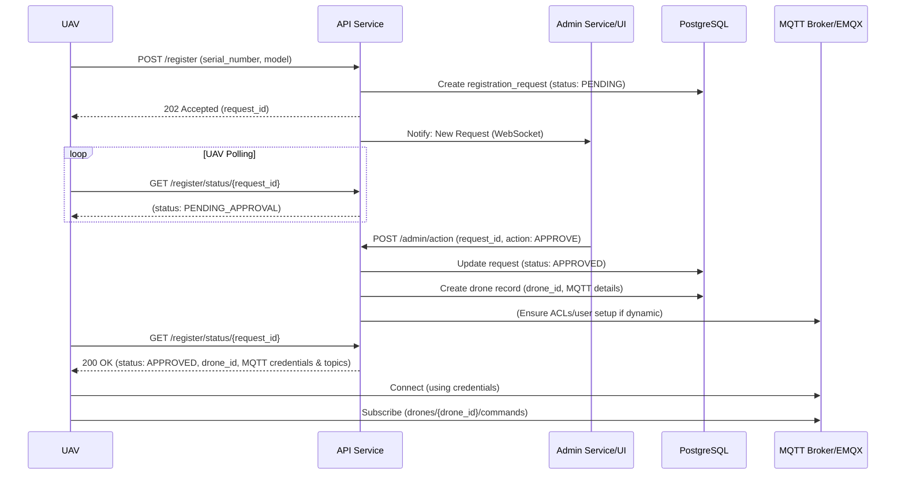
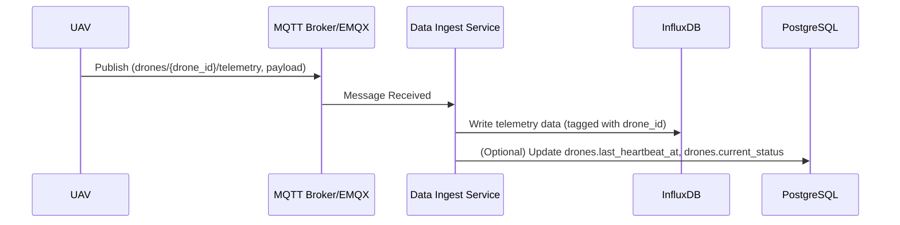

# Unmanned Aerial Vehicle (UAV) Management System: Core Design

## 1. System Overview

This document outlines the core design for an Unmanned Aerial Vehicle (UAV) Management System. The primary goal of this MVP (Minimum Viable Product) is to establish a robust and extensible foundation for UAV registration, real-time data communication via MQTT, and data persistence using PostgreSQL for static/relational data and InfluxDB for time-series data.

The system is designed with modularity and scalability in mind, allowing for future expansion of features such as advanced mission planning, geofencing, detailed analytics, and more complex command-and-control scenarios.

**Core Components:**

*   **UAV Registration Service:** Handles the initial onboarding and approval process for new UAVs.
*   **MQTT Communication Service:** Facilitates real-time, bi-directional communication between UAVs and the backend system.
*   **Data Persistence Service:** Manages the storage and retrieval of UAV data.
*   **Administrative Interface (Conceptual):** A web-based UI for administrators to manage registration requests. (Detailed UI/UX is beyond MVP core but interaction points are defined).

## 2. Core Module Design

### 2.1. UAV Registration Module

This module is responsible for managing the lifecycle of a UAV's registration, from initial request to approval or rejection.

**Key Features:**

*   UAV-initiated registration requests via HTTP REST API.
*   Administrator approval/rejection workflow.
*   Secure allocation of credentials and communication resources upon approval.
*   UAV polling mechanism to check registration status.

**API Endpoints (Illustrative):**

*   `POST /api/v1/drones/register`: UAV submits registration details (serial number, model).
    *   Returns a `request_id`.
*   `GET /api/v1/drones/register/status/{request_id}`: UAV polls for registration status.
    *   Returns `PENDING_APPROVAL`, `APPROVED` (with MQTT credentials), or `REJECTED`.
*   `POST /api/v1/admin/registrations/action`: Admin approves/rejects a request.
    *   Takes `request_id` and `action` (APPROVE/REJECT).
*   (Internal) WebSocket endpoint for pushing new registration requests to the admin UI.

**Workflow:**

1.  UAV sends a registration request with its `serial_number` and `model`.
2.  System validates input, creates a `drone_registration_requests` record with `status = PENDING_APPROVAL`, and returns a `request_id`.
3.  System notifies administrators (e.g., via WebSocket to an admin dashboard) of the new request.
4.  UAV periodically polls the status endpoint using its `request_id`.
5.  Administrator reviews the request and approves or rejects it via an admin interface.
6.  If **approved**:
    *   System updates the request status to `APPROVED`.
    *   Generates a unique `drone_id`.
    *   Allocates MQTT credentials (`username`, `password`), topics, and broker information.
    *   Creates a record in the `drones` table (PostgreSQL) with these details.
    *   The next UAV poll will receive the `APPROVED` status and all necessary MQTT connection info.
7.  If **rejected**:
    *   System updates the request status to `REJECTED`.
    *   The next UAV poll will receive the `REJECTED` status. UAV stops polling.

**Extensibility:**

*   Adding more UAV-specific attributes to the registration request (e.g., firmware version, capabilities).
*   Implementing more sophisticated approval workflows (e.g., multi-step approvals).
*   Integrating with an identity management system for administrators.
*   Automated pre-checks for registration requests.

### 2.2. MQTT Communication Module

This module handles all real-time data exchange between registered UAVs and the backend system using an MQTT broker (e.g., EMQX).

**Key Features:**

*   Secure MQTT connection for authenticated UAVs.
*   Defined topic structure for telemetry/heartbeat and commands.
*   Standardized JSON payload format.

**Topic Structure (Example using `drone_id`):**

*   UAV to System (Telemetry/Heartbeat): `drones/{drone_id}/telemetry` (or `drones/{drone_id}/heartbeat`)
    *   Payload: Dynamic data like GPS, altitude, battery, flight status.
*   System to UAV (Commands): `drones/{drone_id}/commands`
    *   Payload: Instructions like `GOTO_WAYPOINT`, `LAND`.
*   System to UAV (Command Acknowledgements - Optional for MVP+): `drones/{drone_id}/command_ack`
    *   Payload: UAV acknowledges receipt or execution status of a command.

**Data Format:** JSON for all MQTT messages. See "Data Models" section for payload examples.

**Security:**

*   Each UAV uses unique credentials (username/password) generated during registration.
*   TLS encryption for MQTT communication is highly recommended for production.
*   MQTT broker Access Control Lists (ACLs) to restrict topic access per UAV (e.g., a UAV can only publish to its own telemetry topic and subscribe to its own command topic).

**Extensibility:**

*   Adding new message types for advanced telemetry or commands.
*   Implementing different Quality of Service (QoS) levels for critical messages.
*   Support for binary payloads if JSON becomes a bottleneck for high-frequency data (consider Protobuf, etc.).
*   Direct UAV-to-UAV communication brokered by MQTT (if future use cases require it).

### 2.3. Data Persistence Module

This module is responsible for storing and managing UAV-related data.

*   **PostgreSQL (Relational Data):** Stores static information, registration details, UAV configurations, and relationships.
*   **InfluxDB (Time-Series Data):** Stores dynamic telemetry data from UAVs, optimized for high-volume writes and time-based queries.

**Data Flow:**

1.  **Registration Data:** Written to PostgreSQL tables (`drone_registration_requests`, `drones`) by the UAV Registration Service.
2.  **Telemetry/Heartbeat Data:**
    *   UAV publishes data to MQTT.
    *   A backend service (MQTT subscriber) consumes these messages.
    *   The service parses the JSON payload.
    *   Time-series fields (latitude, longitude, altitude, battery, speed, etc.) are written to InfluxDB, tagged with `drone_id`.
    *   The `drones` table in PostgreSQL can be updated with latest status or `last_heartbeat_at`.

**Extensibility:**

*   Adding new tables in PostgreSQL for missions, flight plans, maintenance logs, etc.
*   Creating new measurements in InfluxDB for different types of time-series data (e.g., sensor readings from specific payloads, detailed engine diagnostics).
*   Implementing data archiving and retention policies.
*   Integrating a data lake for raw data storage and advanced analytics.

## 3. Data Models

### 3.1. PostgreSQL Schema

**Table: `drone_registration_requests`**

*   `request_id` (UUID, PK): Unique ID for the registration attempt.
*   `serial_number` (VARCHAR(255), NOT NULL): UAV serial number.
*   `model` (VARCHAR(100), NOT NULL): UAV model.
*   `status` (VARCHAR(50), NOT NULL, DEFAULT 'PENDING_APPROVAL'): e.g., 'PENDING_APPROVAL', 'APPROVED', 'REJECTED'.
*   `requested_at` (TIMESTAMP WITH TIME ZONE, NOT NULL, DEFAULT NOW()): Timestamp of request.
*   `processed_at` (TIMESTAMP WITH TIME ZONE): Timestamp of approval/rejection.
*   `admin_notes` (TEXT): Notes from the administrator (e.g., reason for rejection).
*   `drone_id` (UUID, FK, NULLABLE, UNIQUE): Links to `drones` table if approved.

**Table: `drones`**

*   `drone_id` (UUID, PK): Unique system-wide ID for the UAV.
*   `serial_number` (VARCHAR(255), UNIQUE, NOT NULL): UAV serial number.
*   `model` (VARCHAR(100), NOT NULL): UAV model.
*   `registration_request_id` (UUID, FK, NOT NULL, UNIQUE): Links to the original registration request.
*   `approved_at` (TIMESTAMP WITH TIME ZONE, NOT NULL): Timestamp of registration approval.
*   `mqtt_broker_url` (VARCHAR(255), NOT NULL): MQTT broker connection URL.
*   `mqtt_username` (VARCHAR(255), UNIQUE, NOT NULL): MQTT username.
*   `mqtt_password_hash` (VARCHAR(255), NOT NULL): Hashed MQTT password.
*   `mqtt_topic_telemetry` (VARCHAR(255), NOT NULL): MQTT topic for telemetry.
*   `mqtt_topic_commands` (VARCHAR(255), NOT NULL): MQTT topic for commands.
*   `last_heartbeat_at` (TIMESTAMP WITH TIME ZONE, NULLABLE): Last time a heartbeat was received.
*   `current_status` (VARCHAR(50), DEFAULT 'OFFLINE'): e.g., 'OFFLINE', 'ONLINE', 'FLYING', 'IDLE'.
*   `created_at` (TIMESTAMP WITH TIME ZONE, NOT NULL, DEFAULT NOW())
*   `updated_at` (TIMESTAMP WITH TIME ZONE, NOT NULL, DEFAULT NOW())

### 3.2. InfluxDB Schema

**Measurement: `drone_telemetry`** (or `drone_heartbeat`)

*   **Tags (indexed):**
    *   `drone_id` (String): The unique ID of the UAV.
    *   `flight_status` (String, optional): Current flight status reported by UAV.
*   **Fields (data values):**
    *   `latitude` (Float)
    *   `longitude` (Float)
    *   `altitude` (Float)
    *   `battery_percentage` (Integer)
    *   `speed` (Float, optional)
    *   `rssi` (Integer, optional, signal strength)
    *   ... (other dynamic readings)
*   **Timestamp:** Managed by InfluxDB (typically the time the data point is ingested or provided by the UAV).

### 3.3. MQTT Message Payloads (JSON Examples)

**UAV Telemetry/Heartbeat (Published by UAV):**
```json
{
  "timestamp": "2023-10-28T12:34:56Z", // ISO8601
  "latitude": 34.0522,
  "longitude": -118.2437,
  "altitude": 150.5, // meters
  "battery_percentage": 75,
  "flight_status": "FLYING", // e.g., IDLE, FLYING, LANDING, ERROR
  "speed": 10.2 // m/s
}
```

**System Command (Published by System):**
```json
{
  "command_id": "cmd_uuid_12345", // Unique ID for tracking
  "action": "GOTO_WAYPOINT",
  "parameters": {
    "target_latitude": 34.0550,
    "target_longitude": -118.2500,
    "target_altitude": 120.0,
    "speed": 8.0
  }
}
```

## 4. Core Business Processes (Simplified)

### 4.1. UAV Registration and Onboarding



### 4.2. UAV Data Reporting (Heartbeat/Telemetry)



## 5. Extensibility Design Considerations

To ensure the system can grow and adapt, the following principles are key:

*   **Modular Architecture:** Services (Registration, MQTT Handling, Data Ingestion) should be loosely coupled. This allows independent development, deployment, and scaling. Consider microservices if complexity grows significantly.
*   **Clear API Contracts:** Well-defined and versioned APIs (REST, WebSocket, MQTT message formats) are crucial for inter-service communication and for third-party integrations.
*   **Configuration-Driven:** Avoid hardcoding. Parameters like MQTT broker addresses, database connection strings, and default settings should be configurable.
*   **Asynchronous Processing:** Utilize message queues (like RabbitMQ or Kafka, or even MQTT itself for some internal tasks) for operations that don't require immediate synchronous responses, improving resilience and scalability (e.g., complex post-registration tasks).
*   **Stateless Services (where possible):** Design backend services to be stateless to simplify scaling and load balancing. State should reside in databases or distributed caches.
*   **Service Discovery:** As the number of services grows, a service discovery mechanism (e.g., Consul, etcd) will be beneficial.
*   **Database Abstraction:** While directly using PostgreSQL and InfluxDB is fine for MVP, consider an Object-Relational Mapper (ORM) for PostgreSQL and a suitable client library for InfluxDB to abstract some direct database interactions, potentially easing migrations or introduction of other data stores later.
*   **Authentication & Authorization:** Centralize AuthN/AuthZ if possible. For MVP, MQTT username/password and API keys might suffice, but plan for OAuth2/OIDC for more complex user/service interactions.

## 6. Future Outlook (Potential Extensions)

The core design aims to provide a solid base for features like:

*   **Mission Planning & Execution:** Uploading flight plans, sending mission commands.
*   **Geofencing:** Defining virtual boundaries and alerting/acting on breaches.
*   **Real-time Video Streaming:** Integrating video feeds from UAVs.
*   **Advanced Analytics & Reporting:** Generating insights from collected data.
*   **User Roles & Permissions:** More granular access control for different user types.
*   **Fleet Management:** Grouping and managing multiple UAVs collectively.
*   **Automated Anomaly Detection:** Identifying unusual UAV behavior or data patterns.
*   **Integration with Air Traffic Management (ATM) Systems.**

By focusing on a clean, extensible core, these and other features can be incrementally added to the system. 